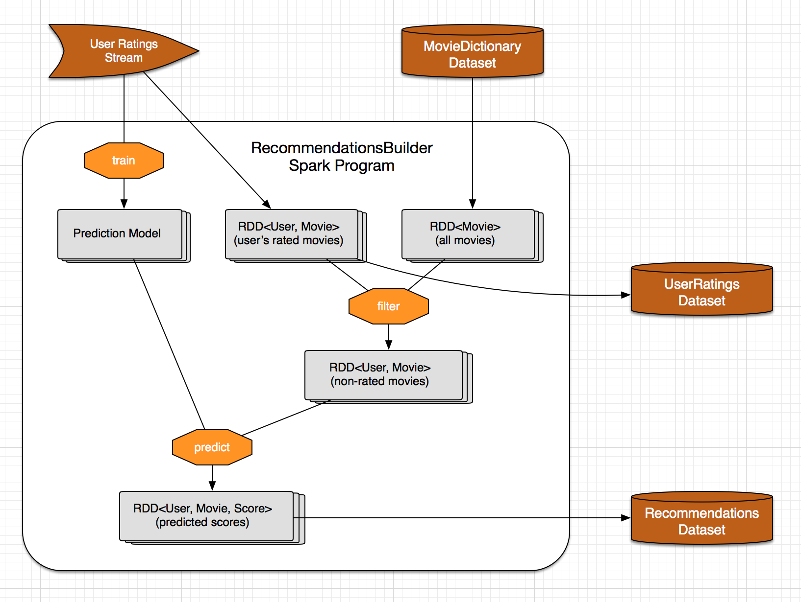

MovieRecommender
================

Movie recommendation application for CDAP_.

Overview
--------
The MovieRecommender application recommends movies to users using collaborative filtering.

* The ``ratings`` and ``movies`` data is taken from the `MovieLens Dataset <http://grouplens.org/datasets/movielens/>`_
* The recommendation engine is based on the ALS (Alternating Least Square) implementation in Apache Spark MLlib library.

Implementation Details
----------------------

The MovieRecommender application is composed of the components:

* ``Streams`` for ingesting ``ratings`` data into the system
* A ``MovieDictionaryService`` to store ``movies`` in a ``Dataset``
* A ``Spark`` Program which builds a recommendation model using the ALS algorithm and recommends
  movies for all the users
* A ``MovieRecommenderService`` to query the application by ``userId`` to get recommendations for a particular user

|(App)|

The ``RecommendationBuilder`` Spark program contains the core logic for building the movie
recommendations. It uses the ALS (Alternating Least Squares) algorithm from Apache Spark's MLlib
to train the prediction model.

|(RecommendationBuilder)| 

First, ``RecommendationBuilder`` reads the ``ratingsStream`` and uses it to train the prediction
model.  Then, it computes an RDD of not-rated movies using the ``movies`` dataset and the
``ratings`` dataset. It uses the prediction model to predict a score for each not-rated movie and
stores the top 20 highest scored movies for each user in the ``recommendations`` dataset.

Installation & Usage
====================
*Pre-Requisite*: Download and install CDAP_.

From the project root, build ``MovieRecommender`` with `Apache Maven <http://maven.apache.org/>`_ ::

  MAVEN_OPTS="-Xmx512m" mvn clean package

Deploy the Application to a CDAP instance:
 From the Standalone CDAP SDK directory, use the Command Line Interface::

  $ ./bin/cdap-cli.sh deploy app <path-to-MovieRecommender-jar-file>
  
Start the Application Flow and Services:
 From the Standalone CDAP SDK directory, use the Command Line Interface::

  $ ./bin/cdap-cli.sh start flow MovieRecommender.RatingsFlow
  $ ./bin/cdap-cli.sh start service MovieRecommender.MovieRecommenderService
  $ ./bin/cdap-cli.sh start service MovieRecommender.MovieDictionaryService
  
Check that the Flow and Services are running (note that the
``RecommendationBuilder`` Spark program will be started later):
 From the Standalone CDAP SDK directory, use the Command Line Interface::

  $ ./bin/cdap-cli.sh get flow status MovieRecommender.RatingsFlow
  $ ./bin/cdap-cli.sh get service status MovieRecommender.MovieRecommenderService
  $ ./bin/cdap-cli.sh get service status MovieRecommender.MovieDictionaryService
  
Ingest ``ratings`` and ``movies`` data::

  bin/ingest-data.sh --host [host]

Run the ``RecommendationBuilder`` Spark Program:
 From the Standalone CDAP SDK directory, use the Command Line Interface::

  $ ./bin/cdap-cli.sh start spark MovieRecommender.RecommendationBuilder

You can check if it has completed by checking its status (once done, it becomes ``STOPPED``):
 From the Standalone CDAP SDK directory, use the Command Line Interface::

  $ ./bin/cdap-cli.sh get spark status MovieRecommender.RecommendationBuilder
  
Once the Spark program is complete, you can query for recommendations via an HTTP request using the ``curl`` command::

  curl -v -d '{"userId":"1"}' \
  -X POST 'http://localhost:10000/v2/apps/MovieRecommender/services/MovieRecommenderService/methods/getRecommendation'

On Windows, a copy of ``curl`` is located in the ``libexec`` directory of the example::

  libexec\curl -v -d '{"userId":"1"}' \
  -X POST 'http://localhost:10000/v2/apps/MovieRecommender/services/MovieRecommenderService/methods/getRecommendation'
  
This will return a JSON response of rated and recommended movies::

  {"rated":["ratedMovie1","ratedMovie1"],"recommended":["recommendedMovie1","recommendedMovie2"]}

Alternately, you can use the Command Line Interface to execute this query::

  $ ./bin/cdap-cli.sh call service MovieRecommender.MovieRecommenderService GET recommend/{userId}

To stop the application, execute:
 From the Standalone CDAP SDK directory, use the Command Line Interface::

  $ ./bin/cdap-cli.sh stop flow MovieRecommender.RatingsFlow
  $ ./bin/cdap-cli.sh stop service MovieRecommender.MovieRecommenderService
  $ ./bin/cdap-cli.sh stop service MovieRecommender.MovieDictionaryService

License
=======

Copyright © 2014 Cask Data, Inc.

Licensed under the Apache License, Version 2.0 (the "License"); you may not use this file except
in compliance with the License. You may obtain a copy of the License at

  http://www.apache.org/licenses/LICENSE-2.0

Unless required by applicable law or agreed to in writing, software distributed under the License
is distributed on an "AS IS" BASIS, WITHOUT WARRANTIES OR CONDITIONS OF ANY KIND, either express
or implied. See the License for the specific language governing permissions and limitations under
the License.

.. |(App)| image:: docs/img/App.png

.. _CDAP: http://cdap.io
