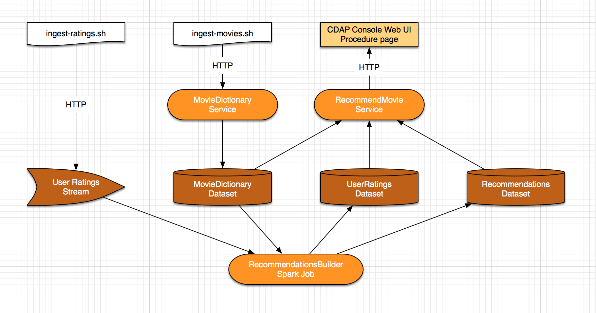

MovieRecommender
================

Movie recommendation application

Overview
--------
The MovieRecommender recommends movies to users using collaborative filtering technique.

* The ``ratings`` and ``movies`` data is taken from `MovieLens Dataset <http://grouplens.org/datasets/movielens/>`_
* The recommendation engine is based on the ALS (Alternating Least Square) implementation in Apache Spark MLlib library.

Implementation Details
----------------------

There are number of components that compose MovieRecommender CDAP application.

* ``Streams`` for ingesting ``ratings`` data into the system
* ``Flowlet`` in a ``Flow`` which processes this ``ratings`` data and store them in a ``Dataset``
* ``Service`` to store ``movies`` in ``Dataset``
* ``Spark`` Program which builds a recommendation model using ALS algorithm and recommends movies for all the users
* ``Procedure`` to query the application with userId to get recommendations for a particular user

|(App)|

Most interesting part that holds the logic behind building recommendations is RecommendationBuilder Spark program.

|(RecommendationBuilder)|

Installation & Usage
====================
From the project root, build ``MovieRecommender`` with the `Apache Maven <http://maven.apache.org/>`_ command::

  MAVEN_OPTS="-Xmx512m" mvn clean package
  
Deploy the Application to a CDAP instance defined by its host (defaults to localhost)::

  bin/app-manager.sh --host [host] --action deploy
  
Start Application Flows, Services and Procedures::

  bin/app-manager.sh --host [host] --action start
  
Make sure that Flows, Services and Procedures are running. We will start Spark program later::

  bin/app-manager.sh --host [host] --action status
  
Ingest ``ratings`` and ``movies`` data::

  bin/ingest-data.sh --host [host]

Run the ``RecommendationBuilder`` Spark Program::

  bin/app-manager.sh --host [host] --action run

Spark program will take some time to complete. You can check the status by::

  bin/app-manager.sh --host [host] --action status
  
Query for recommendations

Send a query via an HTTP request using the ``curl`` command. For example::

  curl -v -d '{"userId":"1"}' \ -X POST 'http://localhost:10000/v2/apps/MovieRecommender/procedures/RecommendMovieProcedure/methods/getRecommendation'

On Windows, a copy of ``curl`` is located in the ``libexec`` directory of the example::

  libexec\curl -v -d '{"userId":"1"}' \ -X POST 'http://localhost:10000/v2/apps/MovieRecommender/procedures/RecommendMovieProcedure/methods/getRecommendation'
  
This will return a JSON of rated and recommended movies::

  {"rated":["ratedMovie1","ratedMovie1"],"recommended":["recommendedMovie1","recommendedMovie2"]}

Stop the application::

  bin/app-manager.sh --host [host] --action stop

:Note: ``[--host ]`` is not available for a *Standalone CDAP*.

License
=======

Copyright © 2014 Cask Data, Inc.

Licensed under the Apache License, Version 2.0 (the "License"); you may not use this file except in compliance with the License. You may obtain a copy of the License at

  http://www.apache.org/licenses/LICENSE-2.0

Unless required by applicable law or agreed to in writing, software distributed under the License is distributed on an "AS IS" BASIS, WITHOUT WARRANTIES OR CONDITIONS OF ANY KIND, either express or implied. See the License for the specific language governing permissions and limitations under the License.

.. |(RecommendationBuilder)| image:: docs/img/RecommendationBuilder.png
