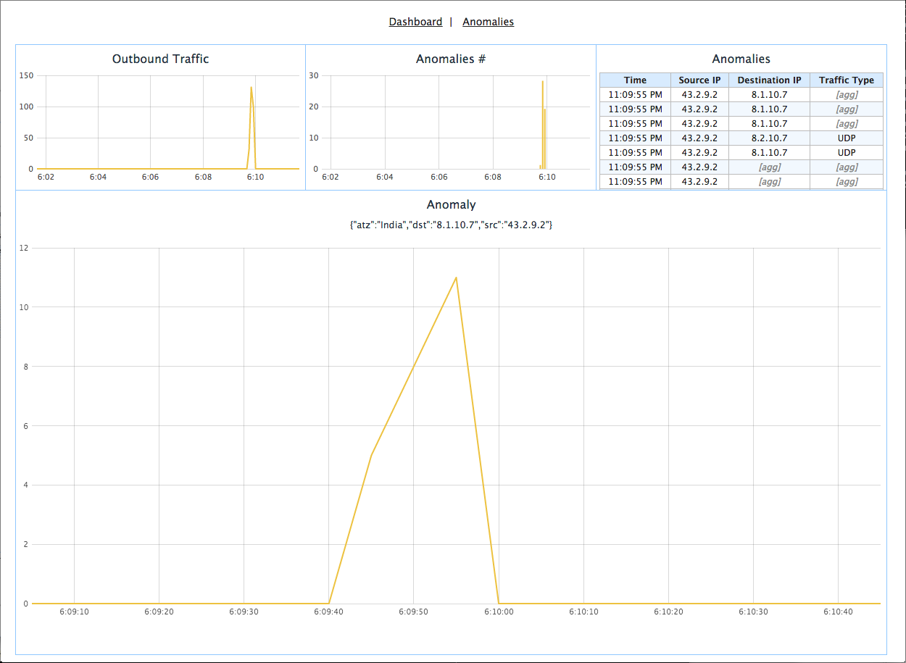
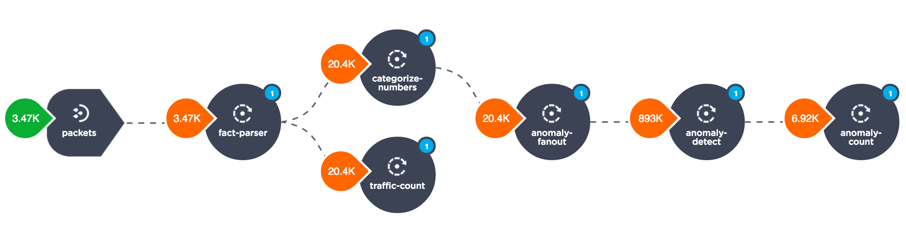

Netlens
=======

Network traffic analytics application for CDAP_.

Overview
--------

The Netlens application analyzes network packets to provide insights on traffic statistics, and
detects anomalies in traffic patterns. The primary features are:

* Uses real-time raw network packet data as a data source
* Provides real-time statistics on overall traffic with a breakdown by source IP

  - Identifies source IPs originating the most traffic
* Detects anomalies in traffic patterns in real-time

  - Uses different combinations of network packet attributes, 
    e.g. detects an unusual increase in UDP traffic originated from particular source IP
* Allows drilling down into detected anomalies' details for inspection
* Provides an overview of traffic stats and anomaly stats for a selected source IP

Sample output of the application can be seen on the following screenshots.

*Dashboard View*

|(Dashboard)|

*Anomalies View*

|(Anomalies)|

*IP Details View*

|(IPDetails)|

The Dashboard page provides a high-level, real-time overview of traffic stats, with detected anomalies
broken down by IP. The Anomalies page exposes more details on the anomalies detected. Selecting an
anomaly or IP in one of the tables brings the user to the IP Details page, where they can inspect
detected anomalies further.

Implementation Details
----------------------

The Netlens application contains the following components:

* A Stream for ingesting data into the system
* A Flow to perform real-time analytics on the incoming data
* Datasets to provide persistence for analytics algorithms and store results
* Services to serve data to a client
* A thin web UI

The main part of the application is ``AnalyticsFlow``, which performs network packet analysis.

|(AnalyticsFlow)|

The flow gets data from the stream, where each event represents a network packet with attributes
like source IP, port, protocol type and others.  JSON-encoded packet details are parsed in the
``fact-parser`` flowlet, and converted into a ``Fact`` Java object (containing a timestamp plus
map of field name to value) that is passed along to the rest of the flow. The ``traffic-count``
flowlet takes a stream of facts as input to compute traffic stats.

Before applying an anomaly detection algorithm in the ``anomaly-detect`` flowlet, 
the numeric values of attributes are categorized in the ``categorize-numbers`` flowlet, and
additional facts are generated, based on the different combinations of attributes in the
``anomaly-fanout`` flowlet.  This keeps the anomaly detection algorithm simple, and allows
controlling which combinations of attributes are interesting to the analysis.

The ``anomaly-count`` flowlet consumes detected anomalies, and uses their details to compute 
stats and fill in the anomalies history log.

Installation & Usage
====================
*Pre-Requisite*: Download and install CDAP_.

Build the Application jar::

  mvn clean package

Deploy the Application to a CDAP instance:
 From the Standalone CDAP SDK directory, use the Command-line Interface::

  $ ./bin/cdap-cli.sh deploy app <path-to-Netlens-jar-file>

Start the Application Flows and Services:
 From the Standalone CDAP SDK directory, use the Command-line Interface::

  $ ./bin/cdap-cli.sh start flow Netlens.AnalyticsFlow
  $ ./bin/cdap-cli.sh start service Netlens.AnomaliesCountService
  $ ./bin/cdap-cli.sh start service Netlens.AnomaliesService
  $ ./bin/cdap-cli.sh start service Netlens.CountersService

Make sure they are running:
 From the Standalone CDAP SDK directory, use the Command-line Interface::

  $ ./bin/cdap-cli.sh get flow status Netlens.AnalyticsFlow
  $ ./bin/cdap-cli.sh get service status Netlens.AnomaliesCountService
  $ ./bin/cdap-cli.sh get service status Netlens.AnomaliesService
  $ ./bin/cdap-cli.sh get service status Netlens.CountersService

Ingest sample traffic data::

  bin/ingest-packets.sh --host [host]

Ingest sample traffic data with anomalies::

  bin/ingest-anomalies.sh --host [host]

Run the Web UI (optionally use ``-Dcdap.host=hostname`` and ``-Dcdap.port=port`` to point to CDAP,
localhost:10000 is used by default)::

  mvn -Pweb jetty:run
  
The Web interface will be available at http://localhost:8080/Netlens

License
=======

Copyright © 2014 Cask Data, Inc.

Licensed under the Apache License, Version 2.0 (the "License"); you may not use this file except
in compliance with the License. You may obtain a copy of the License at

  http://www.apache.org/licenses/LICENSE-2.0

Unless required by applicable law or agreed to in writing, software distributed under the License
is distributed on an "AS IS" BASIS, WITHOUT WARRANTIES OR CONDITIONS OF ANY KIND, either express
or implied. See the License for the specific language governing permissions and limitations under
the License.

.. |(Dashboard)| image:: docs/img/dashboard.png

.. |(Anomalies)| image:: docs/img/anomalies.png

.. _CDAP: http://cdap.io
