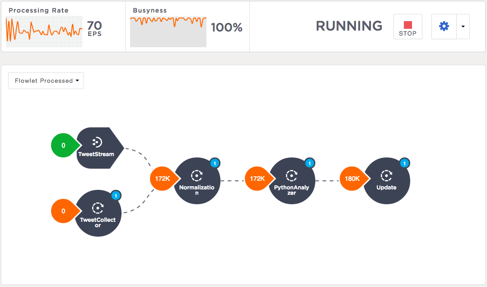

TwitterSentiment
=================
TwitterSentiment Analysis example application for CDAP_. Try it out and discuss it at our `mailing list 
<https://groups.google.com/forum/?hl=en#!forum/cdap-user/>`_.

Overview
--------
The TwitterSentiment application analyzes the sentiments of Twitter tweets and categorizes them as
either positive, negative or neutral.  Key features include:

- Real-time collection of data from Twitter (with optional `Twitter Configuration`_)
- Real-time statistics on analyzed tweets with breakdown by sentiment

Implementation Details
----------------------
The TwitterSentiment application is primarily composed of:

- A stream for ingesting data into the system
- ``SentimentAnalysisFlow`` - collects and emits tweets based upon a sample stream from
  Twitter, analyzes the sentiment of the text, and stores the results. 
- Datasets - ``Table`` and ``TimeseriesTable`` provide persistence for analytics algorithms and
  store results
- ``SentimentQueryService`` - to query the datasets and serve this information to the client
- A simple single-page web UI

The main part of the application is the ``SentimentAnalysisFlow`` that ingests and collects
tweet data, analyzes the tweet text, and stores the results. 

|(SentimentFlow)|

Statements can optionally be ingested into the stream, which feeds into the ``TweetParserFlowlet``
flowlet. This flowlet deserializes the simple statements into a ``Tweet`` object and then passes the
``Tweet`` object to the analyzer flowlet.

By retrieving a sample stream of tweets from Twitter, the ``TweetCollector`` flowlet also produces
``Tweet`` objects and passes them to the ``TweetParserFlowlet`` flowlet and then to the analyze flowlets for
processing.

As the tweets arrive to the analyzer flowlet, the ``ExternalProgramFlowlet`` is responsible for
passing them to a python script which uses NLTK to yield a sentiment for each tweet.

After the tweet is analyzed, it proceeds to the ``CountSentimentFlowlet`` flowlet which persists the data to a
timeseries table based upon the tweet’s timestamp. It also updates a table which keeps track of
the running total of each sentiment.

The stored data can be queried by sending requests to the sentiment-query service. This
service exposes 3 endpoints:

- ``aggregates`` - yields a running total of each sentiment.
- ``sentiments`` - yields a list of tweets for a given sentiment, from the past 300 seconds (this
  time is configurable, as an argument in the http request). 
- ``counts`` - yields the count of tweets for a given sentiment, from the past 300 seconds (this
  time argument is also configurable). 

Installation & Usage
====================
*Pre-Requisite*: Download and install CDAP_.

From the project root, build ``TwitterSentiment`` with `Apache Maven <http://maven.apache.org/>`_ ::

  $ MAVEN_OPTS="-Xmx512m" mvn clean package

Note that the remaining commands assume that the ``cdap`` script is available on your PATH.
If this is not the case, please add it::

  $ export PATH=$PATH:<cdap-home>/bin

If you haven't already started a standalone CDAP installation, start it with the command::

  $ cdap sdk start

On Windows, substitute ``cdap.bat sdk`` for ``cdap sdk``.

Deploy the Application to a CDAP instance defined by its host (defaults to ``localhost``)::

  $ cdap cli load artifact target/TwitterSentiment-<version>.jar
  $ cdap cli create app TwitterSentiment TwitterSentiment <version> user

On Windows, substitute ``cdap.bat cli`` for ``cdap cli``.

Start Application Flows and Services::

  $ cdap cli start flow TwitterSentiment.TwitterSentimentAnalysis
  $ cdap cli start service TwitterSentiment.SentimentQuery

Make sure they are running::

  $ cdap cli get flow status TwitterSentiment.TwitterSentimentAnalysis
  $ cdap cli get service status TwitterSentiment.SentimentQuery

Ingest sample statements::

  $ bin/ingest-statements.sh [--host <hostname>]

On Windows, substitute ``ingest-statements.bat`` for ``ingest-statements.sh``.

Run the Web UI::

  $ mvn -Pweb jetty:run [-Dcdap.host=hostname] [-Dcdap.port=port]

(optionally use ``-Dcdap.host=hostname`` and ``-Dcdap.port=port`` to point to a CDAP instance;
``localhost:11015`` is used by default)

Once the Web UI is running, it can be viewed at http://localhost:8080/TwitterSentiment/.

Stop Application Flows and Services::

  $ cdap cli stop flow TwitterSentiment.TwitterSentimentAnalysis
  $ cdap cli stop service TwitterSentiment.SentimentQuery

Processing Real-time Twitter Data
=================================
In addition to processing the sample statements bundled with the application, the
``SentimentAnalysisFlow`` can be configured to retrieve real-time data from Twitter.

Twitter Configuration
---------------------
In order to utilize the ``TweetCollector`` flowlet, which pulls a small sample stream via the Twitter
API, a Twitter API key and Access token must be obtained and configured. Follow the steps provided by
Twitter to obtain `OAuth access tokens`_.

.. _OAuth access tokens: https://dev.twitter.com/oauth/overview/application-owner-access-tokens

These configurations must be provided as runtime arguments to the flow prior to starting it, in
order to use the ``TweetCollector`` flowlet. To avoid this, configure the ``disable.public``
argument as described below.

Flow Runtime Arguments
----------------------
When starting the ``SentimentAnalysisFlow`` flow from the UI, runtime arguments can be
specified to enable tweet collection.  To add runtime arguments, click on the gear icon shown in
the upper-right of the flow display.

These arguments are supported:

.. list-table::
   :widths: 20 80
   :header-rows: 1

   * - Parameter
     - Description
   * - ``disable.public``
     - Specify any value for this key in order to disable the source flowlet ``TweetCollector``.
   * - ``oauth.consumerKey``
     - Use the value shown under "Application Settings" -> "API key" from Twitter Configuration 
   * - ``oauth.consumerSecret``
     - Use the value shown under "Application Settings" -> "API secret" from Twitter Configuration 
   * - ``oauth.accessToken``
     - Use the value shown under "Your access token" -> "Access token" from Twitter Configuration
   * - ``oauth.accessTokenSecret``
     - Use the value shown under "Your access token" -> "Access token secret" from Twitter
       Configuration

License
=======

Copyright © 2014-2016 Cask Data, Inc.

Licensed under the Apache License, Version 2.0 (the "License"); you may not use this file except
in compliance with the License. You may obtain a copy of the License at

http://www.apache.org/licenses/LICENSE-2.0

Unless required by applicable law or agreed to in writing, software distributed under the License
is distributed on an "AS IS" BASIS, WITHOUT WARRANTIES OR CONDITIONS OF ANY KIND, either express
or implied. See the License for the specific language governing permissions and limitations under
the License. 

.. _CDAP: http://cdap.io

