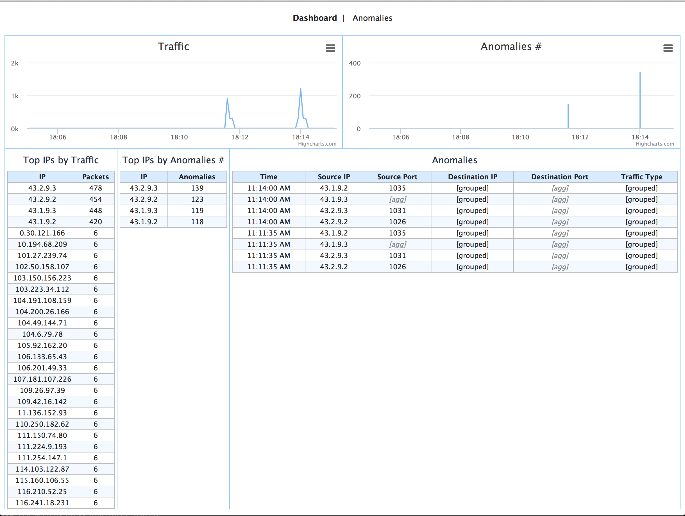
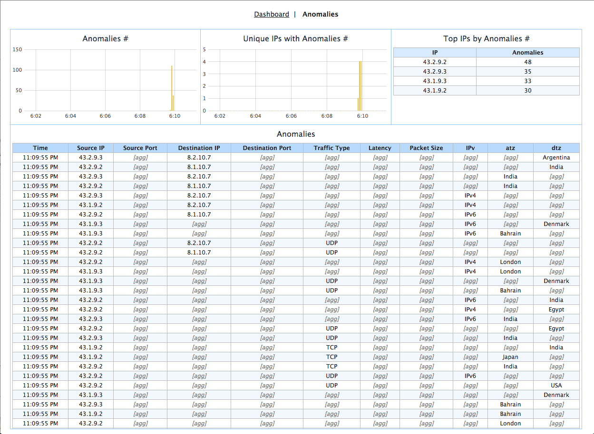
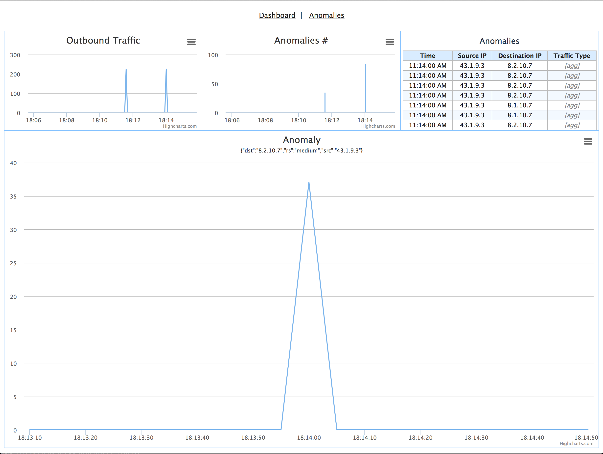

Netlens
=======

Network traffic analytics application.

Overview
--------

The Netlens application analyzes network packets to provide insights on traffic statistics and detects anomalies in the traffic patterns. Primary features:

* Use real-time raw network packets data as a data source
* Provide real-time statistics on overall traffic with breakdown by source IPs

  - Identify source IPs that originate most traffic
* Detect at real-time anomalies in traffic patterns

  - Use different combinations of network packet attributes, 
    e.g. detect unusual increase in UDP traffic originated from particular source IP
* Allow drilling down into detected anomalies details for inspection
* Provide overview of traffic stats and anomalies stats for selected source IP

Example output of the application can be seen on the following screenshots.

*Dashboard View*

|(Dashboard)|

*Anomalies View*

|(Anomalies)|

*IP Details View*

|(IPDetails)|

The Dashboard page provides high-level real-time overview of traffic stats, detected anomalies with breakdown by IPs. The Anomalies page exposes more details on anomalies detected. Selecting an anomaly or IP in the tables brings user to the IP Details page, where he or she can inspect detected anomalies further.

Implementation Details
----------------------

There are number of components that compose Netlens CDAP application:

* Stream for ingesting data into the system
* Flow to perform real-time analytics on the incoming data
* Datasets to provide persistence for analytics algorithms and store results
* Procedures to serve data to a front-end
* Thin web UI

The main part of the application is `analyticsFlow` that performs network packet analysis.

|(AnalyticsFlow)|

The flow gets data from the stream where each event represents a network packet with attributes like source IP, port, protocol type and others. JSON-encoded packet details are parsed in `fact-parser` flowlet and converted into a Fact Java object (timestamp + map of field name to value) that is passed along the rest of the flow. `traffic-count` flowlet takes stream of facts to compute traffic stats.

Before applying anomaly detection algorithm in `anomaly-detect` flowlet, the numeric values of attributes are categorized in `categorize-numbers` flowlet and additional facts are generated based on different combinations of attributes in `anomaly-fanout` flowlet. This keeps anomaly detection algorithm simple and allows controlling which combinations of attributes are interesting to the analysis.

`anomaly-count` flowlet consumes detected anomalies and uses their details to compute stats and fill in the anomalies history log.

Installation & Usage
====================

Build the Application jar::

  mvn clean package

Deploy the Application to a CDAP instance defined by its host (defaults to localhost)::

  bin/app-manager.sh --host [host] --action deploy

Start Application Flows and Procedures::

  bin/app-manager.sh --host [host] --action start

Make sure they are running::

  bin/app-manager.sh --host [host] --action status

Ingest sample traffic data::

  bin/ingest-packets.sh --host [host]

Ingest sample traffic data with anomalies::

  bin/ingest-anomalies.sh --host [host]

Run Web UI::

  mvn -Pweb jetty:run
  
The Web interface will be available at http://localhost:8080/Netlens

License
=======

Copyright © 2014 Cask Data, Inc.

Licensed under the Apache License, Version 2.0 (the "License"); you may not use this file except in compliance with the License. You may obtain a copy of the License at

  http://www.apache.org/licenses/LICENSE-2.0

Unless required by applicable law or agreed to in writing, software distributed under the License is distributed on an "AS IS" BASIS, WITHOUT WARRANTIES OR CONDITIONS OF ANY KIND, either express or implied. See the License for the specific language governing permissions and limitations under the License.

.. |(AnalyticsFlow)| image:: docs/img/analyticsFlow.png
